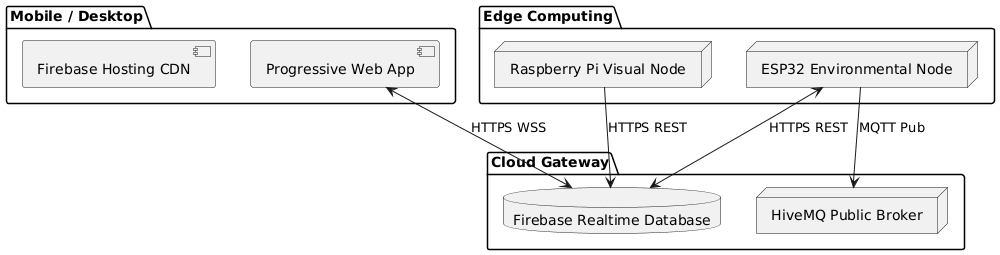

# SolarGuard ☀️🏠🛡️
### AI-Powered Solar Smart Home Security & Energy Management

SolarGuard is an integrated IoT and Machine Learning system designed for sustainable home automation and advanced security. The project leverages solar power to drive an environmental sensor network (ESP32) and a computer vision security hub (Raspberry Pi), all managed through a Progressive Web App (PWA) with real-time cloud integration.

---

## 🚀 Key Features
- **Intelligent Energy Management:** On-device Random Forest occupancy prediction to automate lighting and climate control, reducing energy waste.
- **Solar-First Design:** Entire edge node optimized for solar charging with 18650 Li-ion battery monitoring.
- **Advanced Security:** Raspberry Pi-based visual node providing Face Recognition (LBPH), Fall Detection (HOG), and intruder alerts.
- **Real-Time Cloud Sync:** Seamless data flow between hardware and the PWA via Firebase Realtime Database and HiveMQ MQTT.
- **Sustainable Development Goals (SDG):** Directly addresses SDG 7 (Clean Energy), SDG 9 (Innovation), and SDG 11 (Sustainable Cities).

---

## 🏗️ System Architecture
The system is divided into four main layers:
1. **Perception Layer:** ESP32 sensors (PIR, LDR, Temp, Humidity) + Pi Camera.
2. **Intelligence Layer:** Embedded ML occupancy rules + Computer Vision models.
3. **Communication Layer:** Firebase RTDB (WebSocket/REST) + MQTT (HiveMQ).
4. **Application Layer:** Progressive Web App for real-time monitoring and manual overrides.

---

## 📁 Repository Structure
- **/firmware**: ESP32 C++ source code and control logic.
- **/computer-vision**: Raspberry Pi Python scripts for face and fall detection.
- **/machine-learning**: Jupyter Notebooks for model training and synthetic data generation.
- **/pwa**: Client-side web application source code.
- **/report**: Final project documentation and technical diagrams.

---

## 🛠️ Getting Started
### Firmware (ESP32)
1. Open `firmware/sketch_solarguard_v3.ino` in Arduino IDE.
2. Install `WiFi.h`, `HTTPClient.h`, `ArduinoJson.h`, and `PubSubClient.h`.
3. Configure your WiFi and Firebase credentials in the code.
4. Upload to your ESP32 Dev Module.

### Computer Vision (Raspberry Pi)
1. Install OpenCV, Firebase-Admin, and PiCamera dependencies.
2. Run `computer-vision/recognize_firebase.py` to start the visual security node.

### Progressive Web App
1. Deploy the `/pwa` folder to Firebase Hosting or run locally using a live server.
2. Update `app.js` with your Firebase project configuration.

---

## 👥 Contributors
- **Abdul Hadi** (Project Lead, System Architect, ML Pipeline, PWA)
- **Rehan** (Hardware Integration, Firmware)
- **M Sajid** (Computer Vision, Security Subsystem)

---

## 🎓 Acknowledgements
Developed as a Final Year Engineering Project at **Abu Dhabi University** for the **URIC 2026** competition.
